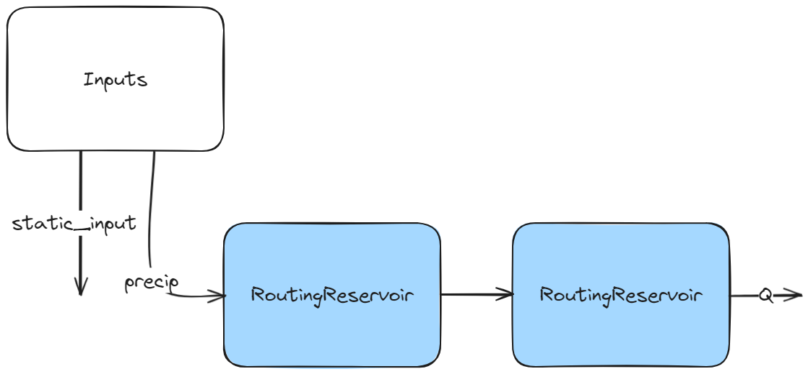
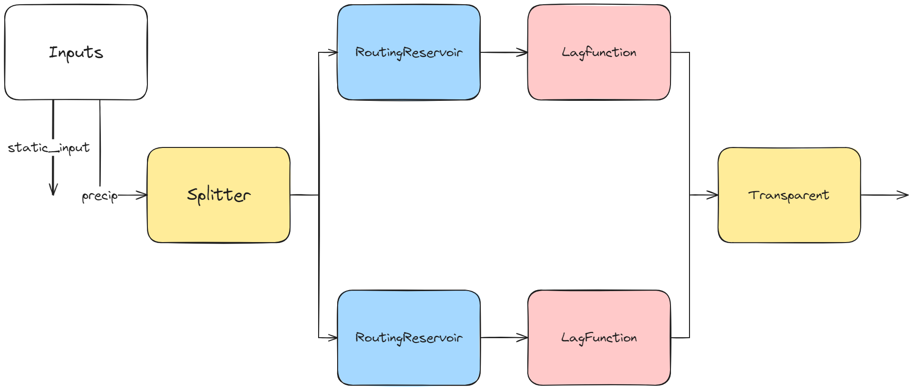
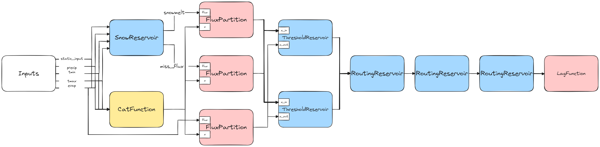

# The Superflex Language

## I - Introduction

A Superflex model in Neuralhydrology is inspired by the [SuperflexPy library](https://superflexpy.readthedocs.io/en/latest/).
In practice, a Superflex model describes SuperflexPy units, i.e., a collection of multiple connected SuperflexPy elements (Reservoirs, lag functions, etc...), referred to as "nodes" here. To construct and optimize the parameters of a Superflex model using Neuralhydrology, it must be specified using the Superflex language, described in this document. The file containing the description of the model can then be passed to Neuralhydrology through the `model_description` field of the configuration file.

The Superflex language allows the user to give the topology of the model only. In other words, the user cannot specify parameter values with this language.

## II - Small example
Let's start with a simple example. Here, two routing reservoirs (also called linear reservoirs) are connected in a row as shown in the picture.

```
Inputs
    static_inputs
    precip

Nodes
    routing1 : RoutingReservoir
    routing2 : RoutingReservoir
    
Edges
    Inputs[precip] - routing1
    routing1 - routing2
```


Note that `static_inputs` is not used in this model.
> ###### Remarks
> - The output of this model is, as for all Superflex models, the output of the final node. 
>
> - This language doesn't take into account spaces and tabs. They are used for readability purposes only. Therefore, spaces **must not** be used in node names: "my node" is not a valid node name.

## III - File construction

A file describing a Superflex model is divided into three sections in this precise order:
1. `Inputs`: specifies the list of inputs of the model.
2. `Nodes`: declares the nodes in the model by giving their names and types.
3. `Edges`: defines the connections between the nodes. 

While the syntax for the `Inputs` is straightforward and doesn't require any additional explanations, the next two sections are dedicated to the syntax for `Nodes` and `Edges`.
> ###### Remark
> There is only two important things to know about the `Inputs` section:
> 1. The order of the inputs must correspond to the sequence in which they are provided to the model during the forward pass.
> 2. The static inputs must be exactly called *static_inputs*, **not** *statics_inputs*, or *static_input*, etc...  


## IV - Nodes

The basic syntax to declare a node is 
```
name_of_the_node : type_of_the_node
```
The list of types of nodes is given in [this section](#viii---list-of-implemented-nodes).

However, one can declare several nodes at the same time with the following syntax (with `X` the number of nodes to declare):
```
name_of_the_node[X] : type_of_the_node
```

> ###### Example
> `routing[5] : RountingReservoir`
> will declare five routing reservoirs called `routing1`, `routing2`, ..., `routing5`.

Finally, when declaring a `LagFunction`, the user needs to specify the number of timesteps. This is done as follows (with `X` the desired number of timesteps):

```
lagfunction : LagFunction(X)
```

## V - Edges

An edge is a directed connection between two nodes. However, since a node can have several input channels (a `ThresholdReservoir` takes one input `x_in`, corresponding to the incoming flux, and `x_out`, corresponding to the evapotranspiration) and several output channels (a `SnowReservoir` has two outputs: `snowmelt` and `miss_flux`), it is sometimes not enough to simply indicate the source and destination nodes.
The complete syntax to declare an edge is:

```
source_node[output_channel] - (input_channel) - destination_node
```
The `[output_channel]` can be omitted if the source node has only one output, and similarly `(input_channel)` is optional if the destination node has only one input.

## VI - Another example - Fluxes combinations

```
Inputs
    static_inputs
    precip

Nodes
    s     : Splitter
    rr[2] : RoutingReservoir
    lf[2] : LagFunction(6)
    t     : Transparent

Edges
    Inputs[precip] - s
    s   - rr1
    s   - rr2
    rr1 - lf1
    rr2 - lf2
    lf1 - t
    lf2 - t
```


In this example, we use a splitter first to distribute the precipitation through two routing reservoirs. Finally, the two fluxes from the two lag functions are *combined* into the transparent node.
When a node receives several fluxes through the same input channel, these fluxes are *combined* together. This combination is a simple *sum*, except if the node is a `CatFunction`, then it is a *concatenation* (using `torch.cat`). The only purpose of a `CatFunction` node is then to concatenate several fluxes. Similarly, the only purpose of a `Transparent` node is to sum several fluxes.
> ######Remark
> We decided to call it `Transparent` instead of `SumFunction` to highlight the fact that, by default, the fluxes are summed.

## VII - A final example

```
Inputs
    static_inputs
    precip
    tmin
    tmax
    evap

Nodes
    s    : SnowReservoir
    c    : CatFunction
    p[3] : FluxPartition
    t[2] : ThresholdReservoir
    r[3] : RoutingReservoir
    lf   : LagFunction(6)

Edges
    Inputs[static_inputs] - (static_inputs) - s
    Inputs[precip] - (precip) - s
    Inputs[tmin] - (tmin) - s
    Inputs[tmax] - (tmax) - s
    Inputs[static_inputs] - c
    Inputs[precip] - c
    Inputs[tmin] - c
    Inputs[tmax] - c
    Inputs[evap] - c
    s[snowmelt] - (flux) - p1
    c - (x) - p1
    s[miss_flux] - (flux) - p2
    c - (x) - p2
    Inputs[evap] - (flux) - p3
    c - (x) - p3
    p1 - (x_in)  - t1
    p1 - (x_in)  - t2
    p2 - (x_in)  - t1
    p2 - (x_in)  - t2
    p3 - (x_out) - t1
    p3 - (x_out) - t2
    t1 - r1
    t2 - r1
    r1 - r2
    r2 - r3
    r3 - lf
```


## VIII - List of implemented nodes


### ThresholdReservoir

A threshold bucket is a bucket with finite height and no drain.
Outflow is from overflow.

##### Input

	x_in  : Incoming flux (eg. precipitation, or output from another reservoir)
	x_out : Missed flux (typically evapotranspiration)

##### Output

	overflow

##### Parameter

	height : positive real number

##### Implementation

	storage = storage + x_in
	storage = max(storage - x_out,  0)
	overflow  = max(storage - height, 0)
	storage = storage - overflow

---
### RoutingReservoir

A routing bucket is a bucket with infinite height and a drain.

##### Input

	x_in : Incoming flux (e.g. precipitation, or output from another reservoir)

##### Output

	outflow

##### Parameter

	rate : strictly positive real number

##### Implementation

	storage = storage + x_in
	outflow  = rate * storage
	storage = storage - outflow
---
### SnowReservoir
A snow bucket is a bucket with infinite height and a drain, where the input is partitioned into one flux that goes into the bucket and one flux that misses the bucket.

##### Input

	static_inputs : The static inputs for the whole model
	precip       : The precipitation
	tmin         : The minimal temperature
	tmax         : The maximal temperature

##### Output

	miss_flux
	snowmelt

##### Parameter

	rate : strictly positive real number

##### Implementation

	miss_flux, in_flux = partition(x=[x_s, tmin, tmax, precip], flux=precip)
	storage = storage + in_flux
	snowmelt = rate * storage
	storage = storage - snowmelt
---
### FluxPartition
Fully connected layer with N normalized outputs.
The weights depend on the input channel `x`.
##### Input

	x            : Values from which the weights are computed
	flux         : Flux to partition

##### Output

	output

##### Implementation

	weights = normalize(sigmoid(x))
	output = weights * flux

### LagFunction
A generic lag function as a convolution.

##### Input

	x_in : incoming flux

##### Output

	output

##### Parameter

	weights

##### Implementation

	storage[0] = x_in * weights #add new value
	output = storage[-1]        #get output
	storage[1:] = storage[:-1]  #shift

---
### CatFunction

Returns a concatenation everything it receives on input.

##### Input

	x : incoming fluxes

##### Output

	output

---
### Transparent

Returns a sum of everything it receives on input.
Every element sums what they receive on each input channel, but this one does nothing apart from that. Can be useful as a final output node, to combine everything.

##### Input

	x : incoming fluxes

##### Output

	output

---
### Splitter

Split the incoming flux into the outgoing connections.
Similar to FluxPartition, but the weights do not depend on anything. The weights are optimized by backpropagation.

##### Input

	x : Incoming flux
##### Output

	output

##### Implementation

	weights = torch.softmax(self.weights, dim=0)
	output = x * weights
